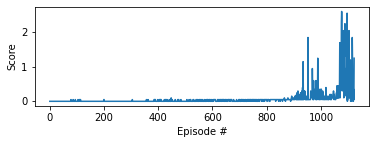

## Environment

In this project, the agent has to navigate in a large square world. A reward of +0.1 is provided for each step that the agent's hand is in the goal location. Thus, the goal of the agent is to maintain its position at the target location for as many time steps as possible.

The observation space consists of 33 variables corresponding to position, rotation, velocity, and angular velocities of the arm. Each action is a vector with four numbers, corresponding to torque applicable to two joints. Every entry in the action vector should be a number between -1 and 1.

The environment has two version, in the first, a single arm is controlled, in the second, 20 arms are training in parallel to speed up experience collection. I choose the first option, where in order to solve the environment, the agent must get an average score of +30 over 100 consecutive episodes.

## Learning Algorithm

The agent utilizes an algorithm called DDPG, which stands for Deep Deterministic Policy Gradient, introduced in [this](https://arxiv.org/abs/1509.02971) paper. The algorithm basically adapts the DQN algorithm to continuous action spaces. It can be considered an actor-critic method as it uses two neural networks, an actor, and a critic, although it works slightly differently than actor-critic methods in the classical sense. Here, the actor learns an optimal deterministic policy, which always outputs the best action given a state. The critic learns to evaluate the optimal action value function, using the actor's output action, much like in Q-Learning. The agent also uses a replay buffer to avoid learining correlated actions, similar as Q-Learning. To encourage exploration, a random noise is added to the action at each step, parameterized by EPSILON. This noise decays as the training progresses, the decay rate is parameterized by EPSILON_DECAY. Another difference from the DQN algorithm that a soft update is utilized instead of a hard update when updating the target networks. This is parameterized by TAU, which is usually a very small number. This means that at every update step, the target network's updated weights contain the local network's weights only in a very small portion.

## Neural Networks

Both the actor and critic networks have a similar architecture, but since they are mapping to different things, their outputs are different. Both of them are 3 layers deep, each layer consisting 128 nodes, and both of them utilize batch normalization. The activation function of the actor network is tanh, so it outputs a single number, which is the action in the continuous action space. The critic maps action-state pairs to Q values, so the activation function is a linear function.

## Agent Performance

When training the agent, the following hyperparameters were used:

```
BUFFER_SIZE = int(1e6)  # replay buffer size
BATCH_SIZE = 256  # minibatch size
GAMMA = 0.99  # discount factor
TAU = 1e-3  # for soft update of target parameters
LR_ACTOR = 1e-3  # learning rate of the actor
LR_CRITIC = 1e-3  # learning rate of the critic
WEIGHT_DECAY = 0  # L2 weight decay
UPDATE_EVERY = 20  # timesteps between updates
NUM_UPDATES = 10  # number of update passes when updating
EPSILON = 1.0  # epsilon for the noise process added to the actions
EPSILON_DECAY = 1e-6  # decay rate for epsilon
NOISE_SIGMA = 0.05  # Noise sigma for the Ornstein-Uhlenbeck process
```

With the above hyperparameters, the training finished in 403 episodes. You can see the scores as a function of episodes during the training below:



## Future Work

Since the performance of the agent was very dependent on hyperparameters, probably a more robust solution could be built using other algorithms, like PPO, TRPO or D4PG.
